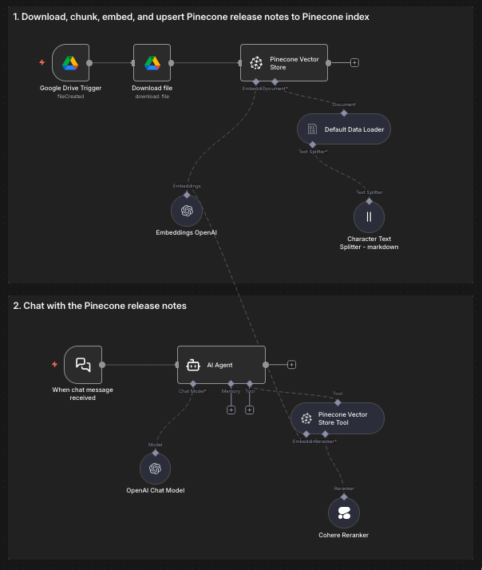

# Chat with your Google Drive docs using Pinecone Vector Database

This n8n workflow template lets you chat with your Google Drive documents (.docx, .json, .md, .txt, .pdf) using OpenAI and Pinecone vector database. It retrieves relevant context from your files in real time so you can get accurate, context-aware answers about your proprietary data—without the need to train your own LLM.

### What is Pinecone Vector Database?
[Pinecone vector database](https://docs.pinecone.io/guides/get-started/overview) indexes and stores vector embeddings for fast retrieval and searching for semantically similar data (semantic search over a dense index) or matching words or phrases (lexical or keyword search over a sparse index), or both (over a hybrid index). This template uses a dense Pinecone index for semantic search.

#### Not interested in chunking and embedding your own data or figuring out which search method to use?

Try our n8n quickstart for Pinecone Assistant [here](https://docs.pinecone.io/guides/assistant/quickstart#n8n) or check out the full workflow to chat with your Google Drive documents [here](https://n8n.io/workflows/9942-rag-powered-document-chat-with-google-drive-openai-and-pinecone-assistant/).

## Try it out

### Prerequisites

* A [Pinecone account](https://app.pinecone.io/) and [API key](https://app.pinecone.io/organizations/-/projects/-/keys)
* A GCP project with [Google Drive API enabled and configured](https://docs.n8n.io/integrations/builtin/credentials/google/oauth-single-service/)
  * Note: When setting up the OAuth consent screen, skip steps 8-10 if running on localhost
* An [Open AI account](https://auth.openai.com/create-account) and [API key](https://platform.openai.com/settings/organization/api-keys)
* A [Cohere account](https://dashboard.cohere.com/welcome/register) and [API key](https://dashboard.cohere.com/api-keys)

### Setup

1. Create a Pinecone index in the Pinecone Console [here](https://app.pinecone.io/organizations/-/projects/-/indexes) 
	1. Name your index `n8n-dense-index`
	2. Select OpenAI's `text-embedding-3-small`
	3. Set the Dimension to `1536`
	4. Leave everything else as default
	5. If you use a different index name, update the related nodes to reflect this change
2. Setup your Google Drive OAuth2 API credential in n8n
	1. In the File added node -> Credential to connect with, select Create new credential
	2. Set the Client ID and Client Secret from the values generated in the prerequisites
	3. Set the OAuth Redirect URL from the n8n credential in the Google Cloud Console ([instructions](https://docs.n8n.io/integrations/builtin/credentials/google/oauth-single-service/#create-your-google-oauth-client-credentials))
	4. Name this credential `Google Drive account` so that other nodes reference it
3. Setup Pinecone API key credential in n8n
	1. In the Pinecone Vector Store node -> Credential to connect with, select Create new credential
	2. Paste in your Pinecone API key in the API Key field
	3. Name this credential  `Pinecone` so that other nodes reference it
4. Setup the Open AI credential in n8n
	1. In the OpenAI Chat Model node -> Credential to connect with, select Create new credential
	2. Set the API Key field to your OpenAI API key
5. Setup the Cohere credential in n8n
	1. In the Cohere Reranker node -> Credential to connect with, select Create new credential
	2. Set the API Key field to your OpenAI API key
6. Add files to a Drive folder named `n8n-pinecone-demo` in the root of your My Drive
	1. Download these files and add them to the Drive folde
		1. https://docs.pinecone.io/release-notes/2025.md
		2. https://docs.pinecone.io/release-notes/2024.md
		3. https://docs.pinecone.io/release-notes/2023.md
		4. https://docs.pinecone.io/release-notes/2022.md
	2. If you use a different folder name, you'll need to update the Google Drive triggers to reflect that change
7. Activate the workflow or test it with a manual execution to ingest the documents
8. Enter the chat prompts:
	1. `What support does Pinecone have for MCP?`
	2. `When was fetch by metadata released?`

### Ideas for customizing this workflow

- Use your own data and adjust the chunking strategy
	- You can read more about choosing a chunking strategy [here](https://www.pinecone.io/learn/chunking-strategies/).
	- You will need to consider the shape of your data and what queries you expect your users to execute. You want chunks that are big enough to contain enough meaningful information, but not so big that the meaning is diluted or it can't fit within the context window of the embedding model.
- Update the AI Agent System Message
	- Change the System Message to reflect what the Pinecone Vector Store Tool will be used for. Be sure to include info on what data can be retrieved using that tool.
- Update the Pinecone Vector Store Tool Description
	- Change the Description to reflect what data you are storing in the Pinecone index
### Need help?

You can find help by asking in the [Pinecone Discord community](https://discord.gg/tJ8V62S3sH), asking on the [Pinecone Forum](https://community.pinecone.io/), or [filing an issue](https://github.com/pinecone-io/n8n-templates/issues/new/choose) on this repo.