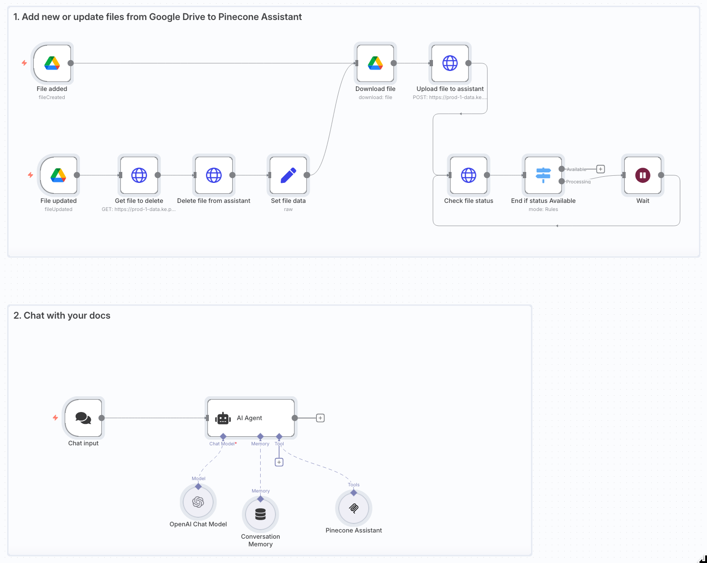

# Chat with your Google Drive docs using Pinecone Assistant

This n8n workflow template lets you chat with your Google Drive documents (.docx, .json, .md, .txt, .pdf) using OpenAI and Pinecone Assistant. It retrieves relevant context from your files in real time so you can get accurate, context-aware answers about your proprietary data—without the need to train your own LLM.

### What is Pinecone Assistant?

[Pinecone Assistant](https://docs.pinecone.io/guides/assistant/overview) allows you to build production-grade chat and agent-based applications quickly. It abstracts the complexities of implementing retrieval-augmented (RAG) systems by managing the chunking, embedding, storage, query planning, vector search, model orchestration, reranking for you.

## Try it out

### Prerequisites

* A [Pinecone account](https://app.pinecone.io/) and [API key](https://app.pinecone.io/organizations/-/projects/-/keys)
* A GCP project with [Google Drive API enabled and configured](https://docs.n8n.io/integrations/builtin/credentials/google/oauth-single-service/)
  * Note: When setting up the OAuth consent screen, skip steps 8-10 if running on localhost
* An [Open AI account](https://auth.openai.com/create-account) and [API key](https://platform.openai.com/settings/organization/api-keys)

### Setup

1. Create a Pinecone Assistant in the Pinecone Console [here](https://app.pinecone.io/organizations/-/projects/-/assistant/-/files) 
	1. Name your Assistant `n8n-assistant` and create it in the `United States` region
	2. If you use a different name or region, update the related nodes to reflect these changes
2. Setup your Google Drive OAuth2 API credential in n8n
	1. In the File added node -> Credential to connect with, select Create new credential
	2. Set the Client ID and Client Secret from the values generated in the prerequisites
	3. Set the OAuth Redirect URL from the n8n credential in the Google Cloud Console ([instructions](https://docs.n8n.io/integrations/builtin/credentials/google/oauth-single-service/#create-your-google-oauth-client-credentials))
	4. Name this credential `Google Drive account` so that other nodes reference it
3. Setup Pinecone API key credential in n8n
	1. In the Upload file to assistant node -> Header Auth section, select Create new credential
	2. Enter `Api-Key` as the Name and paste in your Pinecone API key in the Value field
	3. Name this credential `Pinecone API key - HTTP` so that other nodes reference it
4. Setup Pinecone MCP Bearer auth credential in n8n
	1. In the Pinecone Assistant node -> Credential for Bearer Auth section, select Create new credential
	2. Set the Bearer Token field to your Pinecone API key used in the previous step
5. Setup the Open AI credential in n8n
	1. In the OpenAI Chat Model node -> Credential to connect with, select Create new credential
	2. Set the API Key field to your OpenAI API key
6. Add your files to the Drive folder named `n8n-pinecone-demo` in the root of your My Drive
	1. If you use a different folder name, you'll need to update the Google Drive triggers to reflect that change
7. Activate the workflow or test it with a manual execution to ingest the documents
8. Chat with your docs!

### Ideas for customizing this workflow

- Customize the System Message on the AI Agent node to your use case to indicate what kind of knowledge is stored in Pinecone Assistant
- Configure the Context Window Length in the Conversation Memory node
- Swap out the Conversation Memory node for one that is more persistent
- Make the [chat node publicly available](https://docs.n8n.io/integrations/builtin/core-nodes/n8n-nodes-langchain.chattrigger/#make-chat-publicly-available) or [create your own chat interface](https://docs.n8n.io/integrations/builtin/core-nodes/n8n-nodes-langchain.chattrigger/#mode) that calls the chat webhook URL.

### Need help?

You can find help by asking in the [Pinecone Discord community](https://discord.gg/tJ8V62S3sH), asking on the [Pinecone Forum](https://community.pinecone.io/), or [filing an issue](https://github.com/pinecone-io/n8n-templates/issues/new/choose) on this repo.
