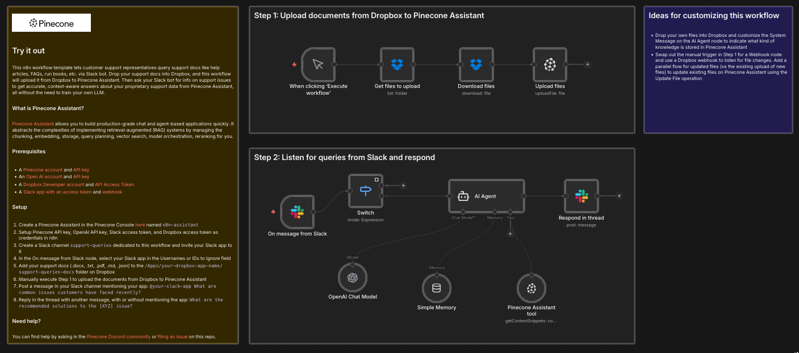

# Query support docs via Dropbox and Slack using Pinecone Assistant

This n8n workflow template lets customer support representatives query support docs like help articles, FAQs, run books, etc. via Slack bot. Drop your support docs into Dropbox, and this workflow will upload it from Dropbox to Pinecone Assistant. Then ask your Slack bot for info on support issues to get accurate, context-aware answers about your proprietary support data from Pinecone Assistant, all without the need to train your own LLM.

### What is Pinecone Assistant?

[Pinecone Assistant](https://docs.pinecone.io/guides/assistant/overview) allows you to build production-grade chat and agent-based applications quickly. It abstracts the complexities of implementing retrieval-augmented (RAG) systems by managing the chunking, embedding, storage, query planning, vector search, model orchestration, reranking for you.

## Try it out

### Prerequisites

* A [Pinecone account](https://app.pinecone.io/) and [API key](https://app.pinecone.io/organizations/-/projects/-/keys)
* An [Open AI account](https://auth.openai.com/create-account) and [API key](https://platform.openai.com/settings/organization/api-keys)
* A [Dropbox Developer account](https://www.dropbox.com/developers) and [API Access Token](https://docs.n8n.io/integrations/builtin/credentials/dropbox/)
* A [Slack app with an access token](https://docs.n8n.io/integrations/builtin/credentials/slack/#using-api-access-token) and [webhook](https://docs.n8n.io/integrations/builtin/trigger-nodes/n8n-nodes-base.slacktrigger/#configure-a-webhook-in-slack)

### Setup

1. Create a Pinecone Assistant in the Pinecone Console [here](https://app.pinecone.io/organizations/-/projects/-/assistant) 
	1. Name your Assistant `n8n-assistant`
	2. No need to configure a Chat model or Assistant instructions
2. Setup Pinecone API key, OpenAI API key, Slack access token, and Dropbox access token as credentials in n8n
3. Create a channel dedicated to this workflow named `support-queries` and invite your Slack app to it
4. Select your Assistant Name in each of the Pinecone Assistant nodes, if it's not already
5. Manually execute Step 1 to upload the documents from Dropbox to Pinecone Assistant
6. Post a message in your Slack channel mentioning your app: `@your-slack-app What are common issues customers have faced recently?`
7. Reply in the thread with another message, with or without mentioning the app: `What are the recommended solutions to the [XYZ] issue?`

### Ideas for customizing this workflow

- Drop your own files into Dropbox and customize the System Message on the AI Agent node to indicate what kind of knowledge is stored in Pinecone Assistant
- Swap out the manual trigger in Step 1 for a Webhook node and use a Dropbox webhook to listen for file changes. Add a parallel flow for updated files (vs the existing upload of new files) to update existing files on Pinecone Assistant using the Update File operation

### Need help?

You can find help by asking in the [Pinecone Discord community](https://discord.gg/tJ8V62S3sH) or [filing an issue](https://github.com/pinecone-io/n8n-templates/issues/new/choose) on this repo.