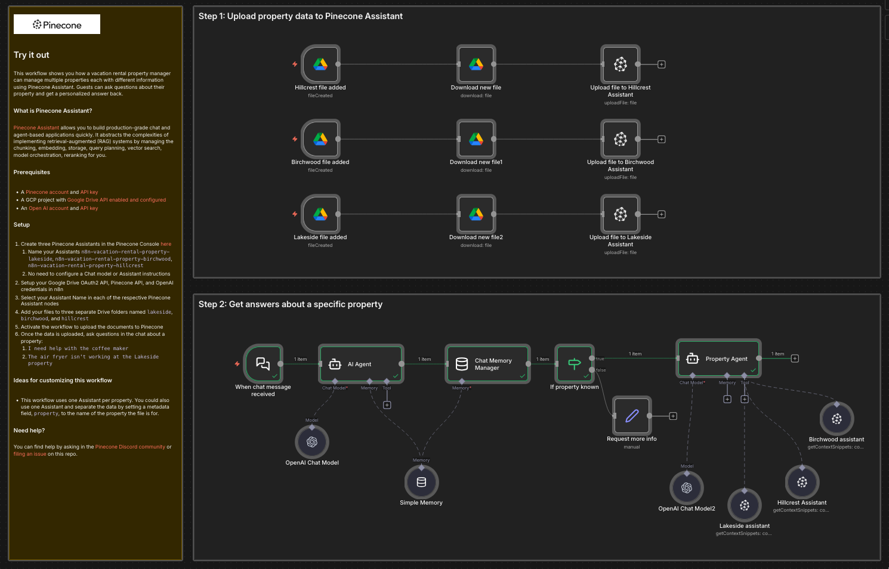

# Vacation rental property manager with multiple Assistants




This workflow shows you how a vacation rental property manager can manage multiple properties each with different information using Pinecone Assistant. Guests can ask questions about their property and get a personalized answer back.
### What is Pinecone Assistant?

[Pinecone Assistant](https://docs.pinecone.io/guides/assistant/overview) allows you to build production-grade chat and agent-based applications quickly. It abstracts the complexities of implementing retrieval-augmented (RAG) systems by managing the chunking, embedding, storage, query planning, vector search, model orchestration, reranking for you.

## Try it out

### Prerequisites

* A [Pinecone account](https://app.pinecone.io/) and [API key](https://app.pinecone.io/organizations/-/projects/-/keys)
* A GCP project with [Google Drive API enabled and configured](https://docs.n8n.io/integrations/builtin/credentials/google/oauth-single-service/)
* An [Open AI account](https://auth.openai.com/create-account) and [API key](https://platform.openai.com/settings/organization/api-keys)

### Setup

1. Create three Pinecone Assistants in the Pinecone Console [here](https://app.pinecone.io/organizations/-/projects/-/assistant) 
	1. Name your Assistants `n8n-vacation-rental-property-lakeside`, `n8n-vacation-rental-property-birchwood`, `n8n-vacation-rental-property-hillcrest`
	2. No need to configure a Chat model or Assistant instructions
2. Setup your Google Drive OAuth2 API, Pinecone API, and OpenAI credentials in n8n
3. Select your Assistant Name in each of the respective Pinecone Assistant nodes
4. Generate the fictional data for this demo using Claude or ChatGPT (or use your own files) and this prompt:
```
Generate fictional data in markdown format in multiple files for three fictional vacation rental properties in a fictional city. The rental property names are:
- **Hillcrest Haven** – cozy hillside cottage
- **Birchwood Retreat** – wooded cabin
- **Lakeside Loft** – modern loft near the water

Include house manual and rules, wifi codes, local restaurant, coffee shop, outdoor recreation, and entertainment recommendations, and fictional appliance manuals for the air fryer, coffee pot, tv, and washer and dryer.

All addresses, cities, names, phone numbers should be fictional. Each set of files should be named based on their property name like "hillcrest_haven_house_manual.md".
```
5. Add the files to three separate Drive folders named `lakeside`, `birchwood`, and `hillcrest`
6. Activate the workflow to upload the documents to Pinecone
7. Once the data is uploaded, ask questions in the chat about a property:
	1. `I need help with the coffee maker`
	2. `The air fryer isn't working at the Lakeside property`

### Ideas for customizing this workflow

- This workflow uses one Assistant per property. You could also use one Assistant and separate the data by setting a metadata field, `property`, to the name of the property the file is for.

### Need help?

You can find help by asking in the [Pinecone Discord community](https://discord.gg/tJ8V62S3sH) or [filing an issue](https://github.com/pinecone-io/n8n-templates/issues/new/choose) on this repo.